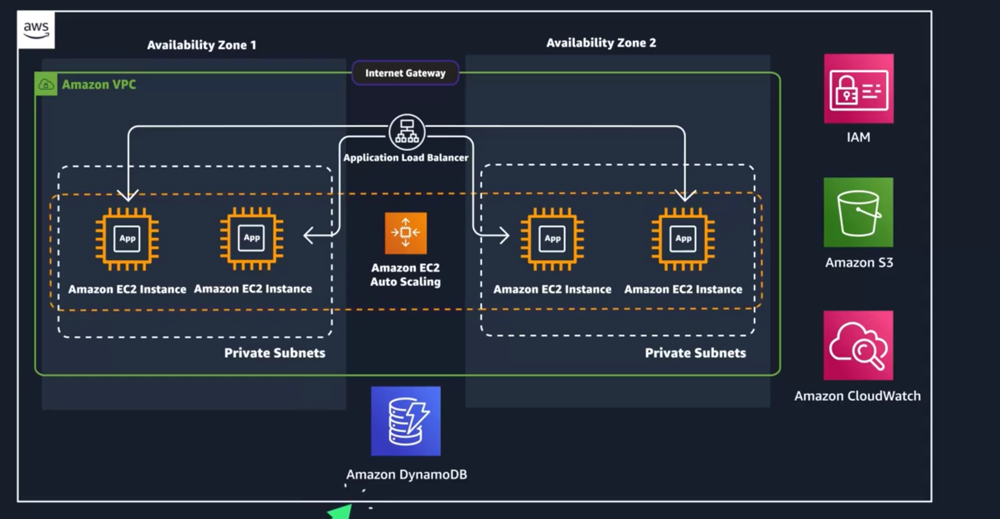

# ☁️ AWS Essentials – Cloud Computing Notes

## ✅ What is Cloud Computing?
Cloud computing is the on-demand delivery of IT resources over the internet with pay-as-you-go pricing.

## 🚀 Cloud Computing Deployment Models
1.  **On-Premises**
    *   All hardware (compute, storage, networking) is owned, hosted, and maintained in the organization's own data centers.
    *   Requires dedicated infrastructure teams and large upfront costs.
    *   Slower time-to-market due to manual setup.
2.  **Cloud**
    *   AWS (or other providers) hosts and maintains the infrastructure.
    *   Users manage their resources virtually via the internet.
    *   Enables quick provisioning, scaling, and innovation without physical hardware.
3.  **Hybrid**
    *   Mix of on-premises infrastructure and cloud resources.
    *   Commonly used to extend existing systems into the cloud.
    *   Helps organizations gradually migrate or create flexible, scalable solutions.

## 🆚 On-Premises vs. Cloud: Deployment Scenario Example
| Action | On-Premises | Cloud |
| :--- | :--- | :--- |
| Set up QA environment | Buy hardware, cable, power, OS install | Provision virtually in minutes |
| Time-to-market | Slower due to setup | Fast and agile |
| Cost | High upfront and maintenance | Pay only for what you use |
| Differentiation | Focus on infrastructure | Focus on business value (code) |

> AWS reduces "undifferentiated heavy lifting": tasks like configuring VMs or backups that don't add business value.

## 🌍 AWS Role
*   AWS provides the IT resources that make up cloud computing: compute, storage, networking, etc.
*   In the course, AWS is used to host a corporate directory application — scalable, cost-effective, and highly available.

## 🛠️ Six Advantages of Cloud Computing
| Advantage | Description |
| :--- | :--- |
| Pay-as-you-go | Only pay for what you use; no upfront costs |
| Massive economies of scale | AWS aggregates global demand → lower costs per customer |
| Stop guessing capacity | Scale up or down based on need (auto-scaling, elasticity) |
| Increase speed and agility | Deploy infrastructure in seconds |
| Realize cost savings | Eliminate capital expense and reduce total cost of ownership |
| Go global in minutes | Deploy apps to global AWS Regions with a few clicks |

## 🌐 AWS Global Infrastructure & Deployment Architecture

### ☁️ 1. AWS Global Infrastructure
**🔸 Core Components:**
*   Regions – Geographic areas with clusters of data centers.
*   Availability Zones (AZs) – One or more isolated data centers within a Region.
*   Edge Locations – Content caching sites for fast delivery to end users.

### 📍 2. AWS Regions
**What is a Region?**
A Region is a physical geographic area where AWS clusters multiple Availability Zones.
*   AWS has 93 AZs across 29 Regions (and growing).
*   Examples:
    *   us-east-1 → Northern Virginia (N. America)
    *   ap-northeast-1 → Tokyo (Asia Pacific)

**🔐 Key Characteristics:**
*   Regions are isolated — AWS does not replicate your data across Regions unless you authorize it.
*   Regions have code names (e.g., us-west-2 = Oregon).

**🧠 Choose a Region Based On:**
| Factor | Why It Matters |
| :--- | :--- |
| Latency | Lower latency = better performance |
| Pricing | Some Regions cost less than others |
| Service availability | Not all AWS services are in all Regions |
| Compliance | Data residency or privacy rules |

### 🏢 3. Availability Zones (AZs)
**What is an AZ?**
An Availability Zone is a group of one or more discrete data centers within a Region.
*   Each AZ has:
    *   Redundant power
    *   Separate networking
    *   Low-latency, high-speed links to other AZs
*   AZ codes example:
    *   us-east-1a → AZ "a" in Northern Virginia
    *   sa-east-1b → AZ "b" in São Paulo

**✅ Best Practice:**
Use at least two Availability Zones for resilience. If one fails, your app stays online.

### 🌍 4. Scope of AWS Services
| Scope | Description |
| :--- | :--- |
| Global | Works across all Regions (e.g., IAM, Route 53, CloudFront) |
| Region | You choose a Region, and AWS manages AZs for you (e.g., S3) |
| AZ | You must specify the AZ (e.g., EC2 instance placement) |

> 💡 Region-scoped services offer built-in redundancy. AZ-scoped services require you to manage resiliency.

### 💡 5. Resiliency Best Practices
*   Use Region-scoped services when possible (e.g., S3, DynamoDB).
*   If using AZ-scoped services (e.g., EC2), replicate across AZs.
*   Goal: Achieve high availability and fault tolerance.

### 🚀 6. Edge Locations & CloudFront
**What is an Edge Location?**
*   A global content caching point to reduce latency for end-users.
*   Over 400+ edge locations worldwide.

**📦 Powered by Amazon CloudFront:**
*   Delivers cached content to users from the closest edge location.
*   Speeds up performance by routing through AWS's backbone network.
*   Example use: Streaming videos, loading websites faster globally.

## 🛠️ Interacting with AWS – API Calls, CLI, Console, SDKs
**✅ Every Action in AWS = API Call**
No matter how you use AWS — web console, CLI, or code — every action is an API call.
These calls are:
*   Authenticated → AWS checks who you are
*   Authorized → AWS checks what you're allowed to do

### 🌐 1. AWS Management Console (Web UI)
*   Web-based interface to view, create, and manage AWS resources
*   Easiest to use for beginners

**Key Console Features:**
| Element | Description |
| :--- | :--- |
| 🔽 Services Menu | Upper-left → grouped by categories (Compute, Storage, etc.) |
| 🌍 Region Selector | Upper-right → lets you switch AWS Region (URL changes) |

### 💻 2. AWS CLI (Command Line Interface)
*   Tool to control AWS from the terminal or scripts
*   Great for automation and repeatable tasks
*   Available for Windows, macOS, Linux

**Example:**
```bash
aws s3api list-buckets
```
**Sample Response:**
```json
{  "Buckets": [    {"Name": "aws-tech-essentials"},    {"Name": "aws-tech-essentials-employee-directory-app"}  ]}
```
> 🧠 Use Case: Schedule a CLI script to collect daily server data instead of manual checks.

### 👨‍💻 3. AWS SDKs (Software Development Kits)
*   Let you make API calls inside your code
*   Available in most major programming languages:
    *   Python (Boto3), JavaScript, Java, Go, .NET, C++, Swift, etc.

**Example (Python – Boto3):**
```python
import boto3
ec2 = boto3.client('ec2')
response = ec2.describe_instances()
print(response)
```
> 🧠 Use Case: A Python app receives a photo → uses SDK to upload it to S3.

### ✅ Summary Table
| Interface | Use Case | Best For |
| :--- | :--- | :--- |
| Console | Manual, visual interaction | Beginners, quick setup |
| CLI | Scripts, automation, terminal use | Admins, DevOps, daily tasks |
| SDK | Code-based integration | Developers building apps |

## 🔐 AWS Shared Responsibility Model
When you use AWS, security and compliance are a shared responsibility between you (the customer) and AWS.

### 🟨 AWS is responsible for: Security of the Cloud
This includes all the infrastructure that AWS manages:
**🧱 Physical & Global Infrastructure**
*   Data centers
*   Power, cooling, and physical access
*   Regions, Availability Zones, and Edge Locations

**🖥️ Hardware & Software**
*   Physical servers and networking equipment
*   Host operating systems
*   Virtualization layer

**🧠 AWS Manages:**
*   The security and uptime of core services like EC2, S3, RDS, etc.
*   The "invisible" foundation beneath all customer-facing services

### 🟦 Customers are responsible for: Security in the Cloud
You manage the parts you create and configure.

**🔐 Customer Responsibilities Include:**
| Layer | What You Control |
| :--- | :--- |
| Customer Data | Encrypt, back up, and protect your data |
| Applications & Access Management | Your app code, user roles, MFA, etc. |
| OS, Firewall & Network Settings | (for EC2, RDS, etc.) patching, rules, etc. |
| Encryption & Identity Protections | Implement SSL, IAM roles, keys, etc. |

> 🔑 You have full control over your data, access, configuration, and how services are used.

### 🧭 Key Principle:
> AWS secures the cloud.
> You secure what you put in the cloud.

### 🧩 Example: EC2 vs. S3
| Service | Who Patches the OS? | Who Manages Data Access? | Who Encrypts Data? |
| :--- | :--- | :--- | :--- |
| EC2 | Customer | Customer | Customer |
| S3 | AWS | Customer | Customer (can use AWS features) |

### 🧠 Tips for Customers:
*   Choose the right Region (compliance/data sovereignty)
*   Enable encryption and backups
*   Use IAM roles, MFA, and least privilege access
*   Regularly audit usage and permissions

## 🔐 AWS Root User & Multi-Factor Authentication (MFA)
### 🧍‍♂️ What is the AWS Root User?
*   The root user is the original identity created when an AWS account is first made.
*   Has full, unrestricted access to all services and billing information.
*   Accessed via the email and password used to create the account.

### 🧾 AWS Root User Credentials
1.  **Console Login Credentials**
    *   Email + password used to access the AWS Management Console
2.  **Access Keys (for programmatic access)**
    *   Access key ID (like a username)
    *   Secret access key (like a password)
    *   Used for AWS CLI or SDKs
    *   �� Best practice: Don't create access keys for root user unless absolutely necessary. If they exist, delete them.

### ✅ Root User Best Practices
| Recommendation | Why |
| :--- | :--- |
| Use a strong password | Prevent easy guessing |
| Enable MFA | Adds an extra security layer |
| Never share root credentials | Protects full account access |
| Delete/disable root access keys | Prevents CLI/API misuse |
| Create IAM users for daily tasks | Least privilege, safer operations |

### 🔐 Multi-Factor Authentication (MFA)
**What is MFA?**
MFA = 2 or more methods of verifying your identity

| Factor Type | Example |
| :--- | :--- |
| ✅ Something you know | Password, PIN |
| ✅ Something you have | Phone app, hardware token |
| ✅ Something you are | Fingerprint, facial recognition |

### 🎯 Why MFA Is Important
*   Single-factor login is weak (e.g., easy-to-guess passwords).
*   If your password is compromised (e.g., Bob's "IloveCats222"), MFA blocks unauthorized access.

### 🔒 MFA on AWS
When MFA is enabled:
*   First: Enter email + password
*   Then: Enter a 6-digit code from your MFA device

**➕ Adds:**
*   Strong protection even if your password is leaked
*   Recommended especially for root users

### 🔐 Supported MFA Device Types
| Device Type | Description | Examples / Vendors |
| :--- | :--- | :--- |
| Virtual MFA | App-based TOTP (soft tokens on phones) | Google Authenticator, Authy, Duo |
| Hardware Token | Physical key fob/display device for 6-digit codes | Key fob, Display card (TOTP standard) |
| FIDO Security Key | Hardware USB keys that use FIDO2/WebAuthn | Yubico keys, FIDO-certified products |

### 🚫 Do Not Use Root User for Daily Work
Use root user only for:
*   Setting up billing
*   Managing account-wide security
*   Creating initial IAM users
➡️ All regular usage should be through IAM users or roles.

## 🔐 AWS Identity, Access, and Security: IAM, Authentication, and Authorization

### 🔑 Authentication vs. Authorization
| Concept | Description | Key Question |
| :--- | :--- | :--- |
| Authentication | Confirms who the user is | "Are you who you say you are?" |
| Authorization | Grants permission to AWS resources & actions | "What are you allowed to do?" |

### 👥 IAM: Identity and Access Management
IAM is the AWS service for managing authentication and authorization in your AWS account.

**✅ With IAM You Can:**
*   Share AWS access without sharing root credentials
*   Assign granular permissions to users, groups, or services
*   Control access using policies

### 👤 IAM Users
*   Represents a person or service that interacts with AWS.
*   Each user has their own:
    *   Username + password (Console access)
    *   Access key + secret key (CLI/API access)
*   IAM user activities are billed to your account.

### 👥 IAM Groups
*   A collection of users that share permissions.
*   ✅ Best Practice: Use groups to manage permissions at scale.
*   Users can:
    *   Belong to multiple groups
    *   Be added/removed easily when roles change
*   Groups cannot contain other groups.

### 🛂 IAM Policies
Used to define permissions (what actions a user/group/role can perform).
**🔹 Policy Format (JSON-based):**
```json
{  "Version": "2012-10-17",  "Statement": [    {      "Effect": "Allow",      "Action": "*",      "Resource": "*"    }  ]}
```
| Element | Description |
| :--- | :--- |
| Version | Specifies policy language version (use 2012-10-17) |
| Effect | Allow or Deny actions |
| Action | What can be done (e.g., s3:ListBucket, ec2:*) |
| Resource | What the action applies to (can use * for all) |

**🔐 Granular Policy Example (Scoped Access):**
```json
{  "Effect": "Deny",  "Action": ["s3:*"],  "Resource": "*",  "Condition": {    "StringNotEquals": {      "aws:ResourceAccount": ["222222222222"]    }  }}
```
> Blocks access to S3 unless the resource is in account 222222222222.

### 🛠️ IAM Roles
*   IAM Role = an identity with temporary credentials.
*   Assigned to:
    *   AWS services (e.g., EC2 instance assuming a role to access S3)
    *   Federated users (e.g., users from Google Workspace, Okta, etc.)

### 🧰 IAM Best Practices
| Best Practice | Why It Matters |
| :--- | :--- |
| 🔐 Lock down root user | Root has full power — avoid using it |
| 🎯 Use least privilege principle | Grant only the minimum permissions required |
| 🧑‍🤝‍🧑 Use IAM appropriately | Separate users, roles, groups for clarity |
| 🎭 Use IAM roles when possible | Roles offer temporary, secure credentials |
| 🆔 Use identity providers | For integrating with corporate login systems |
| 🧹 Regularly review & clean up access | Remove unused users, roles, keys, or policies |

## 🖥️ Servers & Compute on AWS

### 🌐 What is a Server?
A server is a computer (or a group of computers) that handles requests from clients and sends back responses.
**In AWS:**
*   Servers run your web apps, APIs, databases, and more.
*   They provide CPU, memory, and network to power applications.

### 🔁 Client-Server Model
| Role | Description |
| :--- | :--- |
| Client | A person/app that makes a request |
| Server | A machine that processes requests & responds |

> Example: When you visit a website, your browser (client) asks the server to send back the page (response).

### ⚙️ Common HTTP Server Software
| OS | Examples |
| :--- | :--- |
| Windows | IIS (Internet Information Services) |
| Linux | Apache, Nginx, Apache Tomcat |

### 📦 AWS Compute Services Overview
To run a server in AWS, you need compute power — AWS offers multiple compute options:
**💡 3 Core Compute Types in AWS**
| Type | Description | AWS Example |
| :--- | :--- |
| Virtual Machines (VMs) | Emulate physical servers; most familiar to IT folks | Amazon EC2 |
| Containers | Lightweight, isolated app environments that share the OS kernel | Amazon ECS, Amazon EKS |
| Serverless | Run code without managing servers or infrastructure | AWS Lambda |

### 💻 Virtual Machines on AWS (Amazon EC2)
**What is EC2?**
Amazon EC2 = Virtual servers in the cloud that you can start, stop, and manage
*   EC2 Instance = a virtual machine
*   AWS manages:
    *   The physical hardware
    *   The hypervisor (software that runs VMs)
    *   The host operating system

**🧠 Why Start with EC2?**
*   It's the most fundamental compute service
*   Other services (like containers/serverless) often run on top of EC2

**📌 Key Concept: Hypervisor**
*   A hypervisor is software that allows multiple VMs to run on a single physical host.
*   AWS uses hypervisors to create your EC2 instances behind the scenes.

# ☁️ Amazon EC2

Amazon EC2 is a web service that provides secure, resizable compute capacity in the cloud. With this service, you can provision virtual servers called EC2 instances.

## ⚡ Amazon Elastic Compute Cloud (Amazon EC2)

With Amazon EC2, you can:
- 🚀 Provision and launch one or more EC2 instances in minutes
- 🛑 Stop or shut down EC2 instances when you're done
- 💰 Pay by the hour or second (min. 60 seconds)

Manage EC2 instances via:
- 🖥️ AWS Management Console
- 💻 AWS CLI
- 🧰 AWS SDKs
- 🔁 Automation tools & Infrastructure as Code (IaC)

---

## 🖼️ Amazon Machine Image (AMI)

An **AMI** includes:
- 🧠 Operating system
- 🗂️ Storage mapping
- 🏗️ Architecture type
- 🔐 Launch permissions
- 🧩 Preinstalled software

### 📘 AMI vs EC2 Instance

An **EC2 instance** is like a cake 🍰 made from the recipe (AMI):
- AMI = blueprint
- EC2 = running server

When launched:
- Hypervisor provisions the VM
- AMI is copied to the root volume
- You install your stack and app

### 🔁 Reusing AMIs

- Save a running instance as a **custom AMI**
- Use it to **spin up identical servers** anytime

---

## 🔍 Finding AMIs

Ways to find AMIs:
- ⚡ Quick Start AMIs
- 🛒 AWS Marketplace AMIs
- 👤 My AMIs
- 🌎 Community AMIs
- 🧱 Custom images

🆔 Each AMI has a unique ID: `ami-xxxxxxxx` (region-specific)

---

## ⚙️ Configuring EC2 Instances

Configure:
- 💾 Instance type (vCPU, memory, etc.)
- 🌐 Network settings
- 🧱 Storage configuration

### 🧮 Instance Sizing

Base it on:
- 📈 Application demands
- 👥 Anticipated user load

✅ With AWS, scale easily using APIs and only pay for what you use!

---

## 🧩 EC2 Instance Types

Instances = CPU + memory + network (+ storage/GPU optional)

### 🔤 Naming Convention

Example: `c5n.xlarge`
- `c` → Compute optimized
- `5` → 5th generation
- `n` → Extra features (e.g., NVMe)
- `xlarge` → Size

### 🧬 Instance Families

Each family fits a purpose:
- 🧮 Compute optimized
- 🧠 Memory optimized
- 📦 Storage optimized
- 🎮 GPU/accelerated

---

## 🌍 EC2 Instance Locations

Default behavior:
- 🔄 Instances go into a **default VPC**
- 🌐 Default VPC = public internet access

⚠️ Don't store sensitive data in default VPC
✅ Use custom VPCs for secure, private networks

---

## 🧱 Architecting for High Availability

EC2 = scoped to **Availability Zones (AZs)**

📌 Tips:
- Spread across **multiple AZs**
- Use **many small instances** instead of one big one
- Distribute workload to avoid single points of failure

Example:
- 1 instance fails out of 10 = ✅ 90% still running

🏗️ Build with redundancy from Day 1!

---

## ✅ Summary

- 🚀 EC2 lets you launch scalable virtual servers
- 🧱 AMIs define your instances
- ⚙️ Choose types/sizes based on need
- 🌐 Use multiple AZs for fault tolerance and availability

# ⚙️ EC2 Instance Lifecycle

An **EC2 instance** transitions between different states from the moment you create it until it's terminated.

### 🔄 Lifecycle States

1. **Pending**
   - The instance is launching.
   - 🟡 Billing has **not started yet**.
   - AWS is copying the AMI, allocating networking, and prepping the instance.

2. **Running**
   - The instance is live and ready.
   - 🟢 **Billing starts** now.
   - You can take actions like `reboot`, `stop`, `terminate`, or `hibernate`.

3. **Reboot**
   - Like restarting a computer.
   - 🔁 The instance **keeps** its IP addresses and DNS name.
   - No data is lost.

4. **Stop / Stopped**
   - Like shutting down your laptop.
   - 🛑 Instance **can be restarted** later.
   - Keeps its private IP and EBS volume.
   - 🧠 RAM is lost unless hibernated.
   - ⚠️ You still pay for **EBS storage**, not instance usage.

5. **Stop-Hibernate**
   - 💤 Similar to putting a laptop to sleep.
   - Saves RAM content to EBS volume.
   - Faster start next time.
   - Only works if **hibernation is enabled** and preconditions are met.

6. **Terminate**
   - ❌ The instance is permanently deleted.
   - All instance store data is lost.
   - You **lose both public and private IPs**.
   - Billing **stops immediately** when entering `shutting-down`.

---

### ❓ Stop vs Stop-Hibernate

| Feature              | Stop                            | Stop-Hibernate                                |
|----------------------|----------------------------------|------------------------------------------------|
| RAM saved            | ❌ No                           | ✅ Yes                                         |
| Faster startup       | ❌ Normal boot                  | ✅ Faster (restores state)                     |
| Costs after stopping | 💰 EBS storage only             | 💰 EBS storage (plus RAM snapshot overhead)   |

---

## 💸 EC2 Pricing Options

Choose the right pricing model based on your workload:

### ☁️ On-Demand Instances
- Pay by the second or hour.
- No commitment.
- Best for short-term or unpredictable workloads.

### 💰 Spot Instances
- Bid for unused EC2 capacity.
- Up to **90% cheaper**, but AWS can terminate anytime.
- Ideal for fault-tolerant or batch jobs.

### 📈 Savings Plans
- Commit to consistent usage (e.g. 1 or 3 years).
- Flexible across instance families and regions.
- Save up to **72%**.

### 🪑 Reserved Instances
- Commit to specific instance type and Region.
- Lower price than On-Demand (up to 75%).
- Best for steady, predictable usage.

### 🧾 Dedicated Hosts
- Physical servers reserved just for you.
- Helps meet compliance or licensing needs.

# 📦 AWS Containers & Orchestration

## 🚀 AWS Compute Overview

AWS provides 3 core compute options:
- 🖥️ **Virtual Machines (VMs)** — Full OS-level control (e.g., Amazon EC2)
- 📦 **Containers** — Lightweight, isolated workloads (e.g., ECS, EKS)
- ⚡ **Serverless** — Run code without managing servers (e.g., AWS Lambda)

No one-size-fits-all — choose the tool that fits your app's architecture and needs.

---

## 📦 What are Containers?

A **container** packages your application **+ dependencies** to run reliably in any environment.

- Runs in **its own environment**, but shares the host OS/kernel.
- 🛠️ Ensures consistency across dev, test, and prod.
- ⚙️ Ideal for:
  - Web applications
  - Lift-and-shift migrations
  - Microservices
  - CI/CD environments

### 🐳 Example: Docker

Docker is a container platform that:
- Simplifies container management
- Manages storage, networking, and images
- Packages app + environment into a portable unit

---

## 🆚 Containers vs. VMs

| Feature                | Virtual Machines (VMs)                  | Containers                            |
|------------------------|------------------------------------------|----------------------------------------|
| OS                     | Each VM runs its own OS                 | Share the host OS                      |
| Overhead               | High (OS per VM)                        | Low (lightweight)                      |
| Start-up time          | Slower                                  | ⚡ Instant                             |
| Use case               | Full control, legacy apps               | Rapid scaling, modern workloads        |
| Example service        | Amazon EC2                              | Amazon ECS / EKS                       |

---

## 🤖 Container Orchestration

At scale, managing containers requires automation.

### 🧠 Challenges:

- Where should each container run?
- What if a container fails?
- What if the server (EC2) fails?
- How to monitor and scale?

### 🛠️ AWS Solutions:

- **Amazon ECS** (Elastic Container Service)
- **Amazon EKS** (Elastic Kubernetes Service)

---

## 📌 Amazon ECS (Elastic Container Service)

ECS is a **fully managed container orchestration** platform by AWS.

### ✅ Features:

- Define containers in a **task definition**
- Run on:
  - ⚙️ EC2 (more control)
  - 🚀 AWS Fargate (serverless option)

### 🧱 Key Component:

**Task Definition** (in JSON) — describes resources for the container:

```json
{
  "family": "webserver",
  "containerDefinitions": [ {
    "name": "web",
    "image": "nginx",
    "memory": "100",
    "cpu": "99"
  } ],
  "requiresCompatibilities": [ "FARGATE" ],
  "networkMode": "awsvpc",
  "memory": "512",
  "cpu": "256"
}
```

### 🔄 ECS Instance Types:

- **Container instance** = EC2 + ECS Agent
- Agent reports to ECS and handles:
  - Starting/stopping containers
  - Scaling
  - Permissions
  - Health checks

---

## ☸️ Amazon EKS (Elastic Kubernetes Service)

**EKS** is AWS's managed Kubernetes offering.

### 🧠 What is Kubernetes?

- Open-source system for managing containerized workloads/services.
- Portable and extensible.
- Brings dev & ops together (DevOps).

### 🔑 EKS Benefits:

- No need to install or maintain Kubernetes control plane
- High availability & scalability
- Perfect for teams already using Kubernetes

### 🆚 ECS vs EKS

| Feature              | Amazon ECS                            | Amazon EKS                             |
|----------------------|----------------------------------------|----------------------------------------|
| Tech Base            | AWS native                             | Kubernetes                             |
| Unit of deployment   | Task                                   | Pod                                    |
| Compute Node Name    | Container Instance                     | Worker Node (Kubernetes Node)          |
| Best for             | Simpler AWS-native container workloads | Kubernetes users needing orchestration |

---

✅ **Tip**: Use **ECS** for simpler setups or if fully inside AWS. Use **EKS** if you're already using Kubernetes or need multi-cloud portability.

## 🚫 Removing the Undifferentiated Heavy Lifting

If you run your code on **Amazon EC2**, AWS is responsible for the **physical hardware**. However, you are still responsible for the **logical controls**, such as:

- 🧠 Guest operating system
- 🔒 Security and patching
- 🌐 Networking
- 📈 Scaling

---

### 🛠️ Container Management on EC2

As covered in the **Container Services** lesson:

If you choose **Amazon ECS** or **Amazon EKS** on EC2:
- ✅ AWS helps with container orchestration (placement, cluster management).
- ❌ You are **still responsible** for maintaining the **underlying EC2 instances**.

---

### 🤔 Is There a Way to Reduce That Burden?

Yes! By going **serverless**, you eliminate the need to manage EC2 instances.

---

## ⚡ Go Serverless

With **serverless compute**, you focus on your application's unique logic — not on managing infrastructure.

All serverless definitions share these four key aspects:

1. 🖥️ **No servers to provision or manage**
2. 📊 **Automatic scaling based on usage**
3. 💸 **No charges for idle resources**
4. 🔁 **Built-in availability and fault tolerance**

---

### 🧩 Serverless Across the Stack

AWS provides serverless solutions across the full application stack.

In the next sections, we'll explore:

- 🚢 **AWS Fargate** – Serverless containers
- 🧠 **AWS Lambda** – Serverless functions

# 🐳 AWS Fargate
### Serverless compute for containers

AWS Fargate is a **serverless, pay-as-you-go compute engine** that allows you to run containers without managing servers or clusters.

---

## 🧱 Without Fargate

When you run containers without Fargate, you need to manage everything:

1. 🏗️ **Build your container image**
2. ⚙️ **Define and deploy EC2 instances**
3. 🧠 **Provision and manage compute and memory resources**
4. 🧩 **Isolate applications in separate VMs**
5. 🔄 **Run and manage both applications and infrastructure**
6. 💵 **Pay for EC2 instances**, even when they're idle

This approach gives more control but also requires more work (infrastructure, scaling, maintenance).

---

## ☁️ With Fargate

When using AWS Fargate, AWS handles the infrastructure, and you focus on your app:

1. 🏗️ **Build your container image**
2. 📐 **Define the compute and memory required**
3. 🚀 **Run and manage your applications**
4. 💸 **Pay only for the compute resources you use**
5. 🛡️ **Application isolation by design**

Fargate **removes the need to provision or manage EC2 instances**, making it easier to deploy and scale applications.

---

## 🔗 Integrations

- ✅ Fully supports **Amazon ECS** and **Amazon EKS**
- 🔐 Native integration with **IAM** for permissions
- 🌐 Runs inside your **Amazon VPC**, allowing private networking

---

## 💡 Why Fargate?

- No need to manage EC2 servers 🖥️
- Built-in **scaling, availability, and fault tolerance** 🔄
- You **only pay for what you use** ⏱️
- Improved **security** and **workload isolation** 🔐
- Ideal for devs who want to **focus on code** instead of infrastructure 🧑‍💻

# ⚙️ AWS Lambda
### Run Code Without Managing Servers

AWS Lambda lets you **run code without provisioning or managing servers**. You can use it for almost any type of application or backend service, including:

- 📊 Data processing
- 📡 Real-time stream processing
- 🤖 Machine learning
- 🔌 WebSockets
- 🌐 IoT and mobile backends
- 🧑‍💻 Web applications (like your employee directory)

---

## 🖥️ What is AWS Lambda?

Lambda runs your code on a **high-availability compute infrastructure**. You simply upload your code, and AWS:

- Handles provisioning & scaling
- Ensures high availability
- Runs your code with **subsecond metering**

You don't manage any servers, containers, or infrastructure — Lambda takes care of it all. 💯

---

## 🧪 How Lambda Works

The foundational unit in Lambda is a **Lambda function**. You can create one via:

- AWS Console
- Lambda API
- AWS CloudFormation
- AWS Serverless Application Model (AWS SAM)

You can **invoke** a Lambda function:

- 🔁 Directly via API
- 🧲 Automatically, by attaching it to a trigger (e.g., S3 file upload, HTTP request, DynamoDB update)

---

## 🧩 Key Lambda Concepts

Here are the building blocks of a Lambda app:

- **Function** – Your actual code logic
- **Trigger** – The event that causes the function to run
- **Event** – The data or request that's passed into the function
- **Application Environment** – The setup around your function (e.g., VPC, environment variables)
- **Deployment Package** – Your code + dependencies (zip file or container)
- **Runtime** – The language environment your function runs in (Node.js, Python, etc.)
- **Function Handler** – The entry point to your function (the method that executes)

---

## 💰 Lambda Pricing

You are **only billed for what you use**:

- **Request Count** – How many times your function is triggered
- **Execution Time** – Rounded up to the nearest **1 millisecond (ms)**
  - ⏱️ No minimum run time
  - Great for **low-latency APIs** or **short-lived functions**

> 🧠 *"No server is easier to manage than no server."* – Werner Vogels, Amazon CTO

This quote perfectly sums up the simplicity of serverless computing with AWS Lambda and AWS Fargate.

---

## 🧠 AWS Compute Model Examples

### 1. 🛍️ E-Commerce Web Application

**Scenario:**
You're building a scalable online store with a product catalog, cart system, user login, and checkout.

**Recommended Compute Model:**
`Amazon ECS on AWS Fargate`

**Why Fargate?**
- 🐳 You can containerize your frontend, backend, and payment service independently (microservices).
- ☁️ Fargate removes the need to manage EC2 — AWS handles scaling and provisioning.
- 🔐 Integrates with IAM, VPC, and load balancers for security and availability.
- 💵 Pay-as-you-go: Only pay for compute used by running containers.

---

### 2. 📷 Image Processing API

**Scenario:**
You have an API that accepts images, processes them (e.g., compression, watermarking), and returns a result.

**Recommended Compute Model:**
`AWS Lambda`

**Why Lambda?**
- 🧠 Each request is independent — no need for a persistent server.
- ⚡ Very fast execution (under a few seconds), perfect for Lambda's cost-efficient billing model (per ms).
- 🧺 Scales automatically with bursts of incoming requests (like 1,000+ images at once).
- 🚫 No idle cost — you only pay when functions run.

---

### 3. 🧾 Legacy ERP System

**Scenario:**
You're migrating a traditional enterprise ERP system that needs full OS access, runs 24/7, and requires custom software installs.

**Recommended Compute Model:**
`Amazon EC2`

**Why EC2?**
- 🖥️ Full control over the operating system, storage, and network.
- 🧩 Can install legacy software, custom libraries, or low-level tools.
- 🧱 Suitable for workloads that don't change frequently and are always running.
- 👷 Ideal for "lift and shift" migrations from on-prem servers to the cloud.

## 🧠 Choosing the Right AWS Compute Model

| Use Case | Choose | Why | Example |
|----------|--------|-----|---------|
| 🧱 **Legacy or custom OS setups**<br>Need full control (e.g., install drivers, custom software) | **Amazon EC2** | 🖥️ Full control over OS, storage, and software. Great for legacy or "lift and shift" apps. | Migrating an old ERP system to the cloud |
| 🐳 **Microservices**<br>Want isolated, modular apps (e.g., frontend, backend, auth, payments) | **ECS/EKS (with or without Fargate)** | 🧩 Run microservices independently using containers. Flexible and scalable. | E-commerce app split into frontend, backend, and payments services |
| ⚙️ **Need control + don't mind managing infrastructure** | **ECS/EKS on EC2** | 💪 You manage the EC2 instances running your containers. Good for performance tuning. | Video streaming platform that needs optimized EC2 setup |
| ⚡ **Want container benefits without server mgmt** | **Fargate** | 🛠️ Run containers without managing EC2. AWS handles scaling and availability. | Backend of a startup app with unpredictable traffic |
| 🧠 **Short, event-based tasks**<br>Functions triggered by uploads, API calls, timers | **Lambda** | ⚡ Instant scale, no server management. Pay per request and duration. | Image resize function triggered on S3 upload |
| 🌐 **Web app backends**<br>Need persistent connections (e.g., user sessions, logins) | **ECS/Fargate or EC2** | 🔄 Lambda isn't ideal for session-based apps. Use containers or EC2. | Social media website backend |
| 📉 **Infrequent, unpredictable workloads**<br>(e.g., process images on upload) | **Lambda** | 💸 Pay only when code runs. Great for unpredictable usage patterns. | OCR service triggered by email attachments |
| 🧾 **Always-on apps**<br>(e.g., ERP, database, monitoring agents) | **EC2 or ECS on EC2** | ⏳ Fargate/Lambda cost more long-term. EC2 is cheaper for 24/7 workloads. | Database engine or analytics dashboard running full-time |

---

## 🔁 Summary Decision Flow

```text
Do I want full OS control? ➜ EC2

Do I want containerization?
 ├── Yes, but no server management ➜ Fargate
 └── Yes, and I want to manage EC2 ➜ ECS or EKS

Is it a short, reactive task (under 15 min)? ➜ Lambda

Is it long-running, session-based, or stateful? ➜ Fargate or EC2
```

## 🧠 Rule of Thumb:
Start serverless (Lambda/Fargate) when building new lightweight apps.
Move to containers/EC2 when you need more control, lower cost, or legacy compatibility.

---
## 🌐 Networking Defined

Networking is how computers around the world communicate. In AWS, networking is built on a global infrastructure of **data centers**, **Availability Zones**, and **Regions**.

---

## 🧱 Networking Basics

Think of networking like sending a letter:

- ✉️ **Letter** = the data/message
- 🏠 **From Address** = sender's address
- 🏡 **To Address** = recipient's address

### Address Format (Physical World):
- Name
- Street
- City
- State/Province
- Postal Code
- Country

💡 Without the complete address, your message can't be delivered properly — same applies to computers.

---

## 🖥️ IP Addresses

Every computer on a network has an **IP address**, like a home has a physical address.

### 📌 Example of a 32-bit IP address (in binary):

11000000 10101000 00000001 00011110


This is a **32-bit address** — each section is 8 bits (1 byte), called an **octet**.

---

## 🔢 IPv4 Notation

Rather than using binary, IP addresses are shown in **decimal**:

- Binary: `11000000 10101000 00000001 00011110`
- Decimal: `192.168.1.30` (IPv4 format)

So, `192.168.1.30` = one unique computer on the network.

---

## 🔁 CIDR Notation (IP Ranges)

To represent **a range of IP addresses**, we use **CIDR notation**:

192.168.1.0/24


### What does `/24` mean?

- `24` bits are **fixed**.
- `32 - 24 = 8` bits are **flexible**.
- 2^8 = **256** possible IPs in this subnet.

### More Examples:

| CIDR | IPs in Range |
|------|--------------|
| `/28` | 16 IPs       |
| `/24` | 256 IPs      |
| `/16` | 65,536 IPs   |

📏 **Rule**: The higher the number after `/`, the **smaller** the subnet.

---

## 📌 CIDR in AWS

- ✅ **Smallest subnet allowed**: `/28` → 16 IPs
- ✅ **Largest subnet allowed**: `/16` → 65,536 IPs

🧠 AWS uses CIDR to define the size of your **Virtual Private Cloud (VPC)** or subnets.

# 🌐 Amazon VPC (Virtual Private Cloud)

A **Virtual Private Cloud (VPC)** is an isolated, customizable network in the AWS Cloud—similar to traditional networks in a data center.

---

## 🛠️ VPC Creation Requirements

When creating a VPC, you must define:

- **Name of the VPC**
- **Region** where the VPC will live
  - VPC spans all **Availability Zones** in the Region
- **IP Range (CIDR notation)**
  - Min size: `/28` → 16 IPs
  - Max size: `/16` → 65,536 IPs
  - Can have 1 primary + up to 4 secondary IPv4 ranges

---

## 🧱 Subnets

Subnets are smaller divisions of your VPC—like virtual LANs.

- Use **Public Subnets** for internet-facing resources (e.g., EC2 web server)
- Use **Private Subnets** for internal services (e.g., database)

You must specify:
- VPC the subnet belongs to (e.g., `10.0.0.0/16`)
- AZ (Availability Zone) the subnet lives in
- Subnet CIDR (must be a subset of the VPC CIDR)

### 🧠 Example Subnet Layout

- VPC CIDR: `10.0.0.0/16`
- Public Subnet: `10.0.0.0/24`
- Private Subnet: `10.0.2.0/24`

---

## ⚙️ High Availability

To ensure fault tolerance:

- Create **at least two subnets** in **different AZs**
- If one AZ fails, your app still runs from another

> "Everything fails all the time" – plan with redundancy in mind ✅

---

## 🔢 Reserved IPs

Each subnet reserves **5 IP addresses** for AWS networking functions.

| Subnet CIDR   | Total IPs | Reserved IPs | Usable IPs |
|---------------|-----------|---------------|------------|
| `10.0.0.0/24` | 256       | 5             | 251        |

---

## 🌍 Gateways

### 🌐 Internet Gateway (IGW)

- Connects your VPC to the **public internet**
- Must be created and **attached to the VPC**
- Highly available and scalable

### 🔐 Virtual Private Gateway (VGW)

- Used to connect your VPC to a **private network** (like a corporate data center)
- Anchors the AWS side of a VPN connection
- Requires a **Customer Gateway (CGW)** on your side

---

## 🚀 AWS Direct Connect

**AWS Direct Connect** establishes a dedicated **private connection** from your data center to AWS.

### Benefits:
- Traffic **never touches the public internet**
- Offers **lower latency and higher security**
- Use to connect directly to **public AWS services** or your **VPC**

---

## 🗺️ Architecture Diagram (Described)

A breakdown of the components in a Direct Connect + VPC setup:

- 📦 **Corporate Data Center**
  - Customer router or firewall
- 📡 **AWS Direct Connect Location**
  - Customer or Partner router → AWS Direct Connect router
- 🔐 **VGW (Virtual Private Gateway)** in AWS
- 🟩 **VPC: `10.0.0.0/16`**
  - 🌐 Public Subnet (`10.0.0.0/24`) → EC2 instance
  - 🔒 Private Subnet (`10.0.2.0/24`) → Database

# 🛣️ Route Tables in AWS VPC

When you create a VPC, AWS automatically creates a **main route table**. This is a set of rules that tells your VPC where to send network traffic.

---

## 📦 Main Route Table

- ✅ Created by default with the VPC.
- 🔄 Allows traffic between all subnets within the VPC (`local` traffic).
- 🚫 Cannot be deleted.
- 🧩 Cannot assign a gateway route table as the main one.
- ✏️ Can be modified (add/remove/alter routes).
- 🔁 Subnets can be explicitly associated with it.

> Subnets without an explicitly assigned route table use the main route table by default.

---

## 🧭 Custom Route Tables

Custom route tables let you control traffic **on a per-subnet basis**, which is useful when:

- Separating **frontend (public)** and **backend (private)** resources.
- Controlling access to the **internet** or **other services**.

✅ When you create a custom route table:

- It **automatically includes the `local` route** (so subnets in the VPC can talk to each other).
- You can add external routes (e.g., `0.0.0.0/0` for internet access).

> If a subnet is **explicitly associated** with a custom route table, it **overrides** the main route table.

---

## 🗺️ Example from the Diagram

- **VPC CIDR block:** `10.0.0.0/16`
- **Public Subnet:** `10.0.0.0/24`
  - Connected to the **internet** via `0.0.0.0/0 → Internet Gateway`
- **Private Subnet:** `10.0.2.0/24`
  - Only uses the local route; **no internet access**

### 📋 Route Tables Overview

| Subnet            | Route Table Used       | Routes                                       |
|-------------------|------------------------|----------------------------------------------|
| Public Subnet     | Custom Route Table     | `10.0.0.0/16 → local`, `0.0.0.0/0 → IGW`     |
| Private Subnet    | Custom Route Table     | `10.0.0.0/16 → local`                         |
| Default (unused)  | Main Route Table       | `10.0.0.0/16 → local`                         |

# 🔒 Securing Subnets and EC2 Instances in AWS

---

## 🧱 Network Access Control Lists (Network ACLs)

A **Network ACL (NACL)** is a virtual firewall that controls **inbound and outbound traffic at the subnet level**.

### 🧭 How it works:
- **Stateless**: Inbound and outbound rules are evaluated separately.
- **Rules**: Defined by rule number, protocol, port range, source/destination, and allow/deny action.
- **Applied at the subnet level**.

---

### 📦 Default Network ACL
- Allows **all inbound and all outbound** traffic by default.
- Good for starting out but not secure for production.

---

### ⚙️ Custom Network ACL Example

| Rule # | Type     | Protocol | Port Range     | Source/Destination | Allow/Deny |
|--------|----------|----------|----------------|---------------------|------------|
| 100    | HTTPS    | TCP      | 443            | 0.0.0.0/0           | ALLOW      |
| 110    | Ephemeral| TCP      | 1025–65535     | 0.0.0.0/0           | ALLOW      |

> 🔁 Because NACLs are stateless, **you must allow both inbound and outbound ports** for return traffic to work.

---

## 🛡️ Security Groups (for EC2)

A **Security Group** acts as a virtual firewall for **EC2 instances**.

### 🧭 How it works:
- **Stateful**: If an inbound connection is allowed, the response is automatically allowed.
- **Applied at the instance level**.
- You define:
  - **Inbound rules** (by default: all blocked)
  - **Outbound rules** (by default: all allowed)

---

### 🔓 Example Inbound Rules

| Type     | Protocol | Port | Source        |
|----------|----------|------|---------------|
| HTTP     | TCP      | 80   | 0.0.0.0/0     |
| HTTPS    | TCP      | 443  | 0.0.0.0/0     |
| SSH/RDP  | TCP      | 22/3389 | My IP Only |

> 💡 You must **explicitly allow** traffic like HTTP (80) or HTTPS (443) for web access.

---

## 📶 Multi-Tier Security Example

### 3-Tier Architecture with Security Groups

| Tier             | Security Group Rules                        |
|------------------|---------------------------------------------|
| Web Tier         | Allow inbound HTTPS (443) from the internet |
| App Tier         | Allow HTTP (80) from Web Tier only          |
| Database Tier    | Allow MySQL (3306) from App Tier only       |

> 🧩 This setup isolates layers **without needing VLANs**, enabling fine-grained control between components using security groups.

---

### 🔑 Key Differences

| Feature          | Network ACL                         | Security Group                        |
|------------------|--------------------------------------|----------------------------------------|
| Level            | Subnet level                         | Instance level                         |
| Stateful?        | ❌ Stateless                         | ✅ Stateful                            |
| Default Behavior | Allow all (default ACL)              | Block all inbound, allow all outbound |
| Use Case         | Broad network control                | Fine-grained instance control         |

## 💾 AWS Storage Services Overview

AWS storage services are grouped into three categories:

- **File storage** – Data is stored as files in a hierarchy.
- **Block storage** – Data is stored in fixed-size blocks.
- **Object storage** – Data is stored as objects in flat-structured buckets.

---

## 📁 File Storage

### 🧠 Concept
- Data is stored in **files** organized in a **tree-like hierarchy** of folders.
- Each file has metadata like:
  - File name
  - File size
  - Created date
  - Path (e.g., `computer/Application_files/Cat_photos/cats-03.png`)
- Commonly accessed and mounted by **multiple host computers**.

### ✅ Use Cases
- **Web serving**: Static files for websites.
- **Analytics**: Shared datasets for processing.
- **Media & entertainment**: Centralized access to media libraries.
- **Home directories**: User files and profiles in enterprise environments.

---

## 📦 Block Storage

### 🧠 Concept
- Data is split into **fixed-size blocks**, each with its **own address**.
- No metadata attached other than the address.
- Files are reassembled from blocks upon access.
- High-speed, low-latency data retrieval.
- Efficient updates: only the **changed block** is updated.

### 📝 Example
> Changing one character in a 1-GB file? Only the block containing the character is updated.

### ✅ Use Cases
- **Transactional workloads**: e.g., databases.
- **Containers**: Persistent volumes.
- **Virtual machines**: Boot volumes or app disks.

---

## 🪣 Object Storage

### 🧠 Concept
- Data is stored as **objects** in a **flat structure** (no folders or hierarchy).
- Each object includes:
  - Unique ID
  - Metadata
  - Actual data
- Stored in **buckets** and retrieved using the object key.

### 📝 Example
> Changing one character in an object? The **entire object must be rewritten**.

### ✅ Use Cases
- **Data archiving**: Long-term storage, rarely accessed.
- **Backup and recovery**: Reliable and scalable.
- **Rich media**: Images, videos, documents, etc.

---

## 🏛️ Traditional Equivalents

| Storage Type   | Traditional Equivalent         |
|----------------|--------------------------------|
| Block Storage  | DAS (Direct-Attached Storage) or SAN (Storage Area Network) |
| File Storage   | NAS (Network-Attached Storage) |
| Object Storage | Often not available in traditional systems; cloud-native |

---

## ☁️ Cloud Storage Benefits

- **On-premises**: Requires purchasing, installing, and configuring hardware.
- **Cloud**: Create, delete, and modify storage in **minutes** — more **flexible and scalable**.

## 📁 File Storage Services on AWS

AWS provides two primary services for scalable, managed file storage:

---

### 🌲 Amazon Elastic File System (Amazon EFS)

Amazon EFS is a **fully managed, elastic file storage** system that:
- Automatically **scales** as you add or remove files.
- Requires **no provisioning** of storage capacity.
- Can be **mounted concurrently** to thousands of compute instances.
- Provides **consistent performance** for all attached instances.

#### 💡 Key Benefits:
- Works with both **AWS compute** and **on-premises resources**.
- Easy-to-use web interface.
- **Pay-as-you-go** pricing – only pay for used storage.
- Multiple **storage classes** available:

| Storage Class | Description |
|---------------|-------------|
| EFS Standard | Multi-AZ, high durability & availability |
| EFS Standard-IA | Infrequent access, lower cost |
| EFS One Zone | Single AZ, lower cost, lower durability |
| EFS One Zone-IA | Infrequent access in single AZ, maximum savings |

---

### 🖥️ Amazon FSx

Amazon FSx provides **fully managed high-performance file systems** tailored to specific enterprise workloads.

You can choose from four popular file systems:

| File System | Use Case |
|-------------|----------|
| **FSx for NetApp ONTAP** | Advanced data management with snapshot, cloning, and tiering |
| **FSx for OpenZFS** | ZFS-based workloads needing compression, cloning, and snapshots |
| **FSx for Windows File Server** | Seamless integration with Microsoft Active Directory and SMB protocol |
| **FSx for Lustre** | High-speed processing of large data sets (e.g., machine learning, HPC) |

#### 💡 Why Use FSx?
- Familiar interfaces and capabilities.
- Optimized for **performance, reliability, and security**.
- Great for enterprises needing **feature-rich file systems** in the cloud.

## 🗃️ AWS Block Storage Services

AWS offers two types of block storage for EC2: **Instance Store** and **Amazon EBS**. Each serves different use cases based on performance, durability, and lifecycle needs.

---

### ⚡ Amazon EC2 Instance Store

Amazon EC2 Instance Store provides **ephemeral (temporary) storage** located on physical disks **attached to the host machine**.

#### 🔍 Key Characteristics:
- **Ephemeral**: Data is lost when the instance is stopped or terminated.
- **High Performance**: Useful for fast, temporary data operations.
- **Local to EC2 Host**: Offers extremely low latency.

#### 🧰 Best for:
- Hadoop clusters or distributed workloads that replicate data across instances.
- Temporary data like:
  - Caches
  - Buffers
  - Scratch data

---

### 💾 Amazon Elastic Block Store (Amazon EBS)

Amazon EBS provides **persistent block-level storage** volumes that are **network-attached** to EC2 instances.

#### 📌 Key Features:
- Acts like an **external drive**.
- Data **persists** even after instance termination.
- Volumes can be **detached and reattached** to another instance in the same Availability Zone.

#### 🔁 Analogy to External Drives:
| Feature         | External Drive            | Amazon EBS                        |
|-----------------|---------------------------|-----------------------------------|
| Detachable      | Plug/unplug from computer | Detach/attach to EC2              |
| Separate Device | Lives outside laptop      | Separate from EC2 instance        |
| Size Limited    | e.g., 2TB max             | Up to 64 TiB per volume           |
| 1-to-1 Access   | One computer at a time    | Most EBS volumes = 1 EC2 at once  |

> 🆕 **Multi-Attach**: io1/io2 volumes can be attached to multiple EC2s in same AZ (select types only).

---

### 📏 Scaling Amazon EBS Volumes

1. **Increase Volume Size**
   - Up to **64 TiB** (depending on type).
2. **Attach Multiple Volumes**
   - Create multiple volumes per instance to scale storage linearly.

---

### 🔧 Common EBS Use Cases:
- Operating Systems (root volumes)
- Databases (MySQL, PostgreSQL, etc.)
- Enterprise applications (SAP, Oracle)
- Big Data Analytics Engines (e.g., Spark, Hadoop)

---

### 💽 EBS Volume Types

Volumes are divided into **SSDs (for transactions)** and **HDDs (for throughput)**.

#### SSD Volumes:
- **General Purpose (gp2/gp3)** – Balanced cost and performance
- **Provisioned IOPS (io1/io2)** – High performance for I/O intensive tasks

#### HDD Volumes:
- **Throughput Optimized (st1)** – Big data, data warehouses
- **Cold HDD (sc1)** – Less frequently accessed workloads

---

### ✅ EBS Benefits:

| Feature            | Description                                                                 |
|--------------------|-----------------------------------------------------------------------------|
| High Availability  | Automatically replicated within AZ                                          |
| Data Persistence   | Storage outlives instance lifecycle                                         |
| Data Encryption    | Optional, secure at rest                                                    |
| Flexibility        | Modify volume type, size, and IOPS on the fly                               |
| Backups            | Create EBS **snapshots** for point-in-time backups                          |

---

### 📸 Amazon EBS Snapshots

Snapshots are **incremental backups** stored in Amazon S3 (managed for you):

- Only changed data since the last snapshot is saved.
- Can be used to create **new EBS volumes**.
- Supports **multi-AZ recovery**.

> Example:
> - Volume: 10 GB
> - 2 GB changed → Snapshot stores only 2 GB
> - Snapshots are stored **redundantly** across multiple AZs.


---

# 🪣 Amazon S3 (Simple Storage Service)

## Overview

- Amazon S3 is an **object storage** service that is not tied to compute.
- You can retrieve data from anywhere over the internet.
- Uses a **flat structure** (not hierarchical like file systems).
- Objects are stored inside **buckets**.

---

## 🔑 Key Concepts

- **Object**: A file combined with metadata.
- **Key**: The unique identifier for an object within a bucket.
- **Bucket**: A container for storing objects.
- **Region**: Physical AWS location where a bucket resides.

---

## 🪣 Bucket Naming Rules

- Must be globally unique across AWS.
- 3–63 characters in length.
- Lowercase letters, numbers, hyphens (-), and periods (.)
- Must start and end with a letter or number.
- Cannot be formatted like an IP address.
- Cannot use AWS or Amazon in the name.

---

## 📁 Simulated Hierarchy Using Keys

Amazon S3 is flat, but folders can be simulated using **prefixes** and **delimiters** in object keys.

Example:
```text
testbucket/
├── 2022-03-01/
│   ├── AmazonS3.html
│   └── Cats.jpg
```


## 🔄 Versioning

- Keeps multiple versions of an object in the same bucket.
- Prevents accidental deletions or overwrites.
- Versions are identified by unique version IDs.

### States:

- **Unversioned** (default)
- **Versioning-enabled**
- **Versioning-suspended**

---

## 🔐 Security

- All S3 resources are **private by default**.
- You can control access using:
  - **IAM Policies**
  - **S3 Bucket Policies**
  - **Encryption**

### IAM Policies

- Attach to users/roles to define access.
- Useful for centralized control.

### S3 Bucket Policies

- JSON-based.
- Attached only to buckets.
- Apply to all objects in the bucket.

### Encryption

- **In transit**: SSL/TLS
- **At rest**: Server-side encryption with S3-managed keys (enabled by default)

---

## 🧩 Amazon S3 Storage Classes

| Storage Class                        | Description |
|--------------------------------------|-------------|
| S3 Standard                          | General-purpose for frequently accessed data |
| S3 Intelligent-Tiering              | Auto-optimizes based on access patterns |
| S3 Standard-IA                      | Infrequent access, high-speed retrieval |
| S3 One Zone-IA                      | Cheaper, stored in one AZ only |
| S3 Glacier Instant Retrieval        | Archive with millisecond access |
| S3 Glacier Flexible Retrieval       | Archive with access in minutes to hours |
| S3 Glacier Deep Archive             | Lowest cost, 12-hour retrieval, long-term archive |
| S3 on Outposts                      | Object storage on-premises with AWS Outposts |

---

## 📦 Common Use Cases

- Backup and recovery
- Media and content hosting
- Software distribution
- Data lakes for analytics
- Static website hosting
- Storing static content (CDN)

---

## 🔁 Lifecycle Management

Automate transitions and deletions using S3 Lifecycle rules.

- **Transition actions**: Move data to a different storage class (e.g., Glacier).
- **Expiration actions**: Permanently delete data after a defined time.

### Examples:

- Move logs to Standard-IA after 30 days.
- Archive objects to Deep Archive after 1 year.
- Delete temporary files after 90 days.

# AWS Storage Services: Comparison & Overview

---

## Amazon EC2 Instance Store

- **Type**: Ephemeral block storage
- **Attached to**: The physical server hosting the EC2 instance
- **Key Traits**:
  - Cannot be detached
  - Temporary storage only
  - Ideal for:
    - Buffers
    - Caches
    - Scratch data
- ⚠️ **Not suitable** for long-term storage

---

## Amazon EBS (Elastic Block Store)

- **Type**: Persistent block storage
- **Attached to**: EC2 instance (can be detached and reattached)
- **Volume Types**:
  - **SSD-backed**: Optimized for IOPS (e.g., databases, OS boot volumes)
  - **HDD-backed**: Optimized for throughput (e.g., big data, log processing)

### Key Features:
- Provisioned storage (pay for what you provision)
- Replicated across multiple servers in a single AZ
- Typically attached to a single EC2 instance (except for Multi-Attach volumes)

---

## Amazon S3 (Simple Storage Service)

- **Type**: Object storage
- **Attached to**: Not tied to compute
- **Ideal for**:
  - Static web content
  - Backups & archiving
  - Media files
  - Data lakes & analytics

### Key Features:
- Pay-as-you-go (no need to provision in advance)
- Replicated across multiple AZs in a Region
- Can host static websites
- Unlimited scalability

---

## Amazon EFS (Elastic File System)

- **Type**: File storage
- **Access**: Shared access by 10s to 1000s of compute instances
- **Scales**: Automatically (GBs to PBs)

### Key Features:
- Pay only for what you use
- Elastic, automatically scales
- Highly available and durable (multi-AZ replication)
- Native lifecycle management
- Storage Classes:
  - **EFS Standard**: For high durability & availability
  - **EFS One Zone**: Lower cost, for dev/staging workloads

---

## Amazon FSx

- **Type**: Managed third-party file systems
- **Purpose**: Native compatibility with common enterprise file systems
- **Automates**: Provisioning, configuration, patching, backups

### Use Cases:
- Machine learning
- HPC applications
- Analytics
- Media & entertainment

### FSx File System Options:

| File System                   | Description                                                  |
|------------------------------|--------------------------------------------------------------|
| FSx for NetApp ONTAP         | Managed shared storage with NetApp ONTAP                    |
| FSx for OpenZFS              | Managed shared storage with OpenZFS                         |
| FSx for Windows File Server  | Managed storage with native Windows Server compatibility    |
| FSx for Lustre               | High-performance storage for compute-heavy workloads         |


# 📚 History Behind Enterprise Databases

## Choosing a Database

In the past, database choices were limited. Businesses often picked a database (usually relational) before fully understanding their needs.

---

## 🗄️ Relational Databases

- Organize data into **tables**.
- Each **row** (record) represents an entry.
- Each **column** represents an attribute.
- Data in one table can link to data in another (relationships).

### Example:

**Tables**:
- `Books`: ISBN, Title, Author, Format
- `Sales`: SaleID, ISBN, Quantity
- `Authors`: AuthorID, Name, Country

These tables are connected through shared attributes like `Author`.

> The set of tables, rows, and columns is called a **schema**.
> Relational databases use a **fixed schema**, which is hard to change after setup.

---

## 💽 Relational Database Management Systems (RDBMS)

Tools to manage relational databases using **SQL**.

### Examples:
- MySQL
- PostgreSQL
- Oracle
- Microsoft SQL Server
- Amazon Aurora

### Example Query:

```sql
SELECT * FROM Books;
```

> SQL enables **joins** between tables for complex data analysis.

---

## ✅ Benefits of Relational Databases

- **Complex Queries**: Use SQL to analyze and relate data across tables.
- **Reduced Redundancy**: Avoid duplication by referencing shared data.
- **Familiarity**: Technicians are widely experienced with RDBMSs.
- **Accuracy & Integrity**: Enforces ACID properties:
  - Atomicity
  - Consistency
  - Isolation
  - Durability

---

## 📌 Common Use Cases

- Applications with a **fixed schema**.
- Applications requiring **persistent data storage**.

---

# 🛠️ Unmanaged vs. Managed Databases on AWS

You can run relational databases on AWS using either **unmanaged** or **managed** services.

---

## 🔓 Unmanaged Databases

### On-Premises:
- You manage **everything** (infrastructure, power, OS, DB).

### On Amazon EC2:
- AWS manages: Physical host, network, virtualization.
- You manage: OS, database setup, patches, backups, security.

| Option         | AWS Manages        | You Manage                                |
|----------------|--------------------|--------------------------------------------|
| On-Premises    | Nothing             | Everything                                 |
| EC2-Hosted DB  | Hardware + EC2 host | OS, DB engine, updates, scaling, backups   |

---

## 🔒 Managed Databases

Services like **Amazon RDS** or **Amazon Aurora** handle:

- Provisioning
- Scaling
- Patching
- High availability
- Automated backups

You manage:

- Query optimization
- Application tuning
- Data access

| Option         | AWS Manages                            | You Manage                   |
|----------------|-----------------------------------------|------------------------------|
| RDS/Aurora     | Infrastructure, setup, patching, backups| DB logic, tuning, security   |

> 💡 Use **managed services** when you want **ease of use and scalability**.
> Use **unmanaged** (EC2) when you need **full control**.


# Amazon RDS Overview

Amazon Relational Database Service (Amazon RDS) is a **managed database service** that helps you create and manage relational databases in the cloud without handling traditional database administration tasks.

## Supported Engines

- **Commercial**: Oracle, SQL Server
- **Open Source**: MySQL, PostgreSQL, MariaDB
- **Cloud Native**: Amazon Aurora

---

## Database Instances

- **DB instance** = compute + storage.
- DB instance runs a DB engine and can contain multiple databases.
- Managed through **Amazon RDS console**.
- Instance type and size determine processing power and memory.

---

## Storage on Amazon RDS

RDS storage uses **Amazon EBS volumes** for:
- MySQL, MariaDB, PostgreSQL, Oracle, SQL Server.

**Aurora** uses:
- **Cluster volumes** (SSD-based), spanning 3 Availability Zones.
- **Local storage** for temporary data.

**Storage types**:
- General Purpose SSD (gp2, gp3)
- Provisioned IOPS SSD (io1)
- Magnetic (standard)

---

## Amazon RDS in a VPC

- Each DB instance lives in a **VPC** and a **DB subnet group** (at least 2 AZs).
- Subnets are typically **private** (no route to the internet).
- Access managed by:
  - **Network ACLs**
  - **Security Groups**

---

## Backup Options

### Automated Backups
- Enabled by default.
- Includes entire DB instance + transaction logs.
- Configurable backup window.
- **Point-in-time recovery** available.
- Retention: 0–35 days.

### Manual Snapshots
- User-managed.
- Persist until deleted manually.
- Use for long-term backups.

---

## High Availability with Multi-AZ

- Creates a **standby copy** in another AZ.
- Synchronous replication.
- **Failover** occurs if the primary DB fails.
- DNS name automatically updated on failover.

---

## Amazon RDS Security

### IAM
- Controls who can manage Amazon RDS resources (create, delete, modify, etc.).

### Security Groups
- Define allowed inbound traffic to DB instances (IP address or EC2-based).

### RDS Encryption
- Encrypts data at rest.
- Also applies to snapshots.

### SSL/TLS
- Encrypts data in transit.
- Supported by all major engines: MySQL, PostgreSQL, Oracle, etc.


# Purpose-Built Databases for All Application Needs

## Overview

For a long time, relational databases were the default option for nearly all applications. They are like a multi-tool: good at many things, but not perfect for one particular task. Today, developers can choose purpose-built databases tailored to specific workloads.

AWS provides a broad portfolio of purpose-built databases to support diverse data models. This allows developers to build data-driven, scalable, distributed applications without being restricted to traditional commercial databases.

---

## Amazon DynamoDB

- **Type**: NoSQL (key-value and document)
- **Use Cases**: High-scale applications, serverless applications
- **Key Features**:
  - Fully managed
  - Fast, consistent performance at any scale
  - Infrastructure as Code (IaC) support

---

## Amazon ElastiCache

- **Type**: In-memory caching
- **Engines**: Redis, Memcached
- **Use Cases**: Accelerating application performance by caching frequently accessed data
- **Key Features**:
  - Fully managed
  - Automatic failover, backup, and upgrades

---

## Amazon MemoryDB for Redis

- **Type**: Durable, in-memory database
- **Use Cases**: Microservices architectures, high-performance applications
- **Key Features**:
  - Microsecond read latency, single-digit millisecond write latency
  - Multi-AZ durability
  - Redis-compatible

---

## Amazon DocumentDB (with MongoDB compatibility)

- **Type**: Document database (NoSQL)
- **Use Cases**: Content management, user profiles, web/mobile apps
- **Key Features**:
  - Fully managed
  - MongoDB API compatibility

---

## Amazon Keyspaces (for Apache Cassandra)

- **Type**: Wide-column NoSQL
- **Use Cases**: High-volume apps with simple access patterns
- **Key Features**:
  - Apache Cassandra compatibility
  - Managed scalability and high availability

---

## Amazon Neptune

- **Type**: Graph database
- **Use Cases**: Recommendation engines, fraud detection, knowledge graphs
- **Key Features**:
  - Fully managed
  - Designed for highly connected data

---

## Amazon Timestream

- **Type**: Time series database
- **Use Cases**: IoT, operational applications, event data
- **Key Features**:
  - Serverless
  - Analyzes trillions of events per day
  - Much faster and cheaper than relational DBs

---

## Amazon Quantum Ledger Database (QLDB)

- **Type**: Ledger database
- **Use Cases**: Systems needing a verifiable history of data changes
- **Key Features**:
  - Immutable and cryptographically verifiable change history
  - No need for custom audit table logic

# Amazon DynamoDB Overview

Amazon DynamoDB is a **fully managed NoSQL database service** that provides fast and predictable performance with seamless scalability. With DynamoDB, you can offload the administrative burdens of operating and scaling a distributed database, including:

- Hardware provisioning
- Setup and configuration
- Replication
- Software patching
- Cluster scaling

## Key Features

- Create database tables that can store and retrieve **any amount of data** and serve **any level of request traffic**
- Seamlessly **scale up or down** throughput capacity without downtime or performance degradation
- **Monitor** usage and performance via the **AWS Management Console**
- Automatically replicates data across **multiple Availability Zones** for high availability and durability
- All data is stored on **SSDs**

## Core Components

- **Tables**: Collections of items (similar to rows in relational databases)
- **Items**: Individual records in a table
- **Attributes**: Data fields for each item (similar to columns)
- **Primary Keys**: Unique identifiers for items in a table
- **Secondary Indexes**: Allow flexible querying options

```plaintext
Person Table Example
+-------------+--------+--------------+
| PersonID    | Name   | Email        |
+-------------+--------+--------------+
| 1           | Alice  | a@example.com|
| 2           | Bob    | b@example.com|
+-------------+--------+--------------+
```

## Use Cases

Consider using DynamoDB when:

- Experiencing **scalability issues** with traditional databases
- Actively developing applications or services
- Handling **OLTP workloads**
- Running **mission-critical** applications that require high availability
- You need **high data durability**

### Common Applications

- Developing software applications
- Media metadata stores
- Gaming platforms
- Retail systems

## Security Features

DynamoDB includes built-in security features:

- **Durability**: Data is stored across multiple facilities and devices
- **Encryption at Rest**: Data is encrypted using **AWS KMS**
- **IAM Integration**: Control access via AWS Identity and Access Management
- **Global Network Security**: Inherited from AWS's security infrastructure

## Best Practices

- ✅ **Use AWS CloudTrail** to monitor AWS managed key usage
- ✅ **Use IAM roles** for authentication
- ✅ **Use IAM policy conditions** for fine-grained access
- ✅ **Monitor** DynamoDB operations using CloudTrail


# AWS Database Services

AWS offers a wide range of database options, each tailored for different types of applications and use cases. Below is a summary of the AWS database portfolio and the shift toward purpose-built databases.

## AWS Database Portfolio

| **AWS Service(s)**                                  | **Database Type** | **Use Cases**                                                                 |
|-----------------------------------------------------|-------------------|------------------------------------------------------------------------------|
| Amazon RDS, Aurora, Amazon Redshift                | Relational        | Traditional applications, ERP, CRM, e-commerce                               |
| DynamoDB                                            | Key-value         | High-traffic web applications, e-commerce systems, gaming applications       |
| Amazon ElastiCache for Memcached/Redis             | In-memory         | Caching, session management, gaming leaderboards, geospatial applications    |
| Amazon DocumentDB                                   | Document          | Content management, catalogs, user profiles                                  |
| Amazon Keyspaces                                    | Wide column       | High-scale industrial apps: equipment maintenance, fleet mgmt, optimization  |
| Neptune                                              | Graph             | Fraud detection, social networking, recommendation engines                   |
| Timestream                                          | Time series       | IoT applications, DevOps, industrial telemetry                               |
| Amazon QLDB                                         | Ledger            | Systems of record, supply chain, registrations, banking transactions         |

## Breaking Up Applications and Databases

Modern applications often use a microservices architecture. Instead of relying on a single monolithic database, applications are broken into smaller services, each with its own **purpose-built** database.

This approach supports:
- **Specialization**: Each service uses the most appropriate database type.
- **Scalability**: Independent scaling of services and their databases.
- **Performance**: Optimization based on workload-specific access patterns.

This shift enables a **complementary database strategy**, allowing organizations to choose the right tool for each component of their applications.

# 📊 Purpose of Monitoring

Monitoring is the process of **collecting, analyzing, and using data** to understand and improve the operational health and performance of your systems. It gives you **near real-time insights** into your infrastructure.

## 🔍 Common Monitoring Questions

- How many people are visiting my site day to day?
- Can I track the number of visitors over time?
- How will I know if performance or availability issues occur?
- What happens if my EC2 instance runs out of capacity?
- Will I be alerted if my website goes down?

---

## 📈 What Are Metrics?

- **Metric**: A single data point generated by a resource.
- Metrics collected over time become **statistics** (e.g., average CPU utilization).
- Examples of metrics include:
  - CPU Utilization
  - Network Throughput
  - Disk Read/Write Ops
  - Memory Usage
  - Log Errors

### 🔧 Use Case Example: CPU Utilization

- **High CPU** might mean:
  - A spike in traffic
  - A bug causing resource drain
- Set a **threshold** and use alerts or auto-scaling to respond.

---

## 🧭 AWS Metrics by Service

| AWS Service   | Key Metrics                                                                 |
|---------------|------------------------------------------------------------------------------|
| Amazon S3     | - Object size  <br> - Object count  <br> - HTTP request count                |
| Amazon RDS    | - CPU utilization <br> - DB connections <br> - Disk space                    |
| Amazon EC2    | - CPU utilization <br> - Network utilization <br> - Disk performance <br> - Status checks |

---

## 🎯 Benefits of Monitoring

### ✅ Respond Proactively
- Detect and respond to issues before they impact users.
- Example: Auto-scale an EC2 instance when CPU exceeds threshold.

### 🚀 Improve Performance & Reliability
- Identify and remove bottlenecks.
- Optimize application behavior based on historical performance data.

### 🔐 Recognize Security Threats
- Spot unusual activity such as unauthorized login attempts or data access patterns.
- Trigger security audits or alarms.

### 📊 Make Data-Driven Decisions
- Use monitoring data to decide on scaling, cost control, and architecture design.

### 💸 Create Cost-Effective Solutions
- Understand underutilized resources.
- Right-size infrastructure to save on costs.

# AWS CloudWatch Monitoring

## Purpose of Monitoring

Monitoring helps you understand the health, performance, and usage of your AWS resources by collecting data such as metrics, logs, and events. It enables:

- Tracking system activity
- Responding to performance or availability issues
- Receiving alerts for predefined thresholds

## Amazon CloudWatch Overview

**Amazon CloudWatch** is a monitoring and observability service that:

- Detects anomalous behavior
- Sets alarms
- Visualizes logs and metrics
- Automates actions
- Troubleshoots issues
- Provides operational insights

## CloudWatch Features

- **Basic Monitoring**: 1 data point per 5 minutes (free)
- **Detailed Monitoring**: 1 data point per minute (paid)

## CloudWatch Concepts

- **Metrics**: Time-ordered set of data points
- **Dimensions**: Name-value pairs to categorize metrics
- **Custom Metrics**: User-defined data such as:
  - Webpage load times
  - Request error rates
  - Application-specific counters

## CloudWatch Dashboards

- Customizable home pages
- Visualize data from multiple AWS services and regions
- Use widgets for graphs, numbers, and text

## Amazon CloudWatch Logs

- Centralized storage for logs from EC2, Lambda, etc.
- Supports querying and filtering
- Can generate **metric filters** from logs

### Key Terminology

- **Log Events**: Individual entries
- **Log Streams**: Sequence of events from the same source
- **Log Groups**: Collection of log streams

## CloudWatch Alarms

Alarms monitor metrics and trigger actions.

- **OK**: Within threshold
- **ALARM**: Outside threshold
- **INSUFFICIENT_DATA**: Not enough data

### Steps to Create an Alarm

1. Set up a metric filter (e.g., monitor HTTP 500s)
2. Define the alarm with threshold and period
3. Define the action (e.g., send SNS alert, scale EC2, invoke Lambda)

## Automated Troubleshooting

- Alarms can trigger:
  - EC2 reboot
  - Scaling operations
  - Lambda functions for API calls

CloudWatch enables proactive, automated responses to operational issues.

# Availability

## Availability Percentages and Downtime

| Availability (%) | Downtime (per year)         |
|------------------|-----------------------------|
| 90%              | 36.53 days                  |
| 99%              | 3.65 days                   |
| 99.9%            | 8.77 hours                  |
| 99.95%           | 4.38 hours                  |
| 99.99%           | 52.60 minutes               |
| 99.995%          | 26.30 minutes               |
| 99.999%          | 5.26 minutes                |

To increase availability, you need **redundancy**, which typically involves more infrastructure: more data centers, servers, databases, and data replication. However, higher availability comes with increased cost.

## Why Improve Application Availability?

In the given setup:
- One EC2 instance hosts the application.
- Photos are served from **Amazon S3**.
- Structured data is stored in **Amazon DynamoDB**.

This EC2 instance is a **single point of failure**. Even with highly available databases and S3, users cannot access the application if this one instance goes down.

## Solution: Add a Second Availability Zone

Deploying another EC2 instance in a second **Availability Zone** can help mitigate risks related to:
- Physical hardware failure
- OS-level issues
- Application crashes

### Challenges When Adding a Second Instance

1. **Replication Process**
   - You must replicate configuration files, patches, and application data.
   - Best practice: Automate this process.

2. **Customer Redirection**
   - You need a way to direct client requests to the available servers.
   - Two options:
     - **DNS round-robin**: Maps domain name to multiple IPs but suffers from propagation delays.
     - **Load Balancer**: Preferred approach. Automatically distributes requests and performs health checks.

3. **Types of High Availability**

#### Active-Passive Systems
- One instance handles all traffic while the other remains on standby.
- The passive server takes over if the active one fails.

#### Active-Active Systems
- Both instances serve traffic simultaneously.
- Provides better performance and fault tolerance.


# AWS Load Balancers

## What is Load Balancing?

Load balancing is the process of distributing incoming traffic across multiple targets (e.g., EC2 instances). This improves application availability and fault tolerance.

- **ELB** (Elastic Load Balancing) is AWS's managed load balancer service.
- Requests go: Client → Load Balancer → EC2 → back through Load Balancer → Client.
- Common algorithm: **Round Robin**.

## ELB Features

- **Hybrid Mode:** Supports IPs, including on-premises servers.
- **High Availability:** Works across multiple Availability Zones.
- **Scalability:** Auto-scales with demand.

## Health Checks

- **TCP Checks:** Successful connection = healthy.
- **HTTP/HTTPS Checks:** Validates endpoint returns expected status (e.g., 200 OK).
- **Custom Page (e.g., /monitor):** Checks DB, S3, etc.

### Connection Draining

Allows in-flight requests to complete before terminating an instance.

## ELB Components

- **Listener:** Defines port and protocol.
- **Rule:** Defines how requests are routed.
- **Target Group:** Set of instances or IPs to route traffic to.

## Types of Load Balancers

### 1. Application Load Balancer (ALB)

- Works at **Layer 7** (HTTP/HTTPS).
- Ideal for web apps.
- Supports:
  - Request routing
  - TLS offloading
  - Sticky sessions
  - User auth
  - Logs & metrics

### 2. Network Load Balancer (NLB)

- Works at **Layer 4** (TCP/UDP).
- Ideal for latency-sensitive apps.
- Features:
  - Source IP preservation
  - Static/Elastic IP support
  - DNS failover

### 3. Gateway Load Balancer (GLB)

- Works at **Layer 3 Gateway / Layer 4**.
- Routes traffic to virtual appliances (e.g., firewalls).
- Features:
  - Private connectivity
  - Auto scaling
  - CloudWatch monitoring

## Feature Comparison

| Feature | ALB | NLB | GLB |
|--------|-----|-----|-----|
| Load Balancer Type | Layer 7 | Layer 4 | Layer 3 & 4 |
| Target Type | IP, instance, Lambda | IP, instance, ALB | IP, instance |
| Protocols | HTTP, HTTPS | TCP, UDP, TLS | IP |
| Static IP / Elastic IP | No | Yes | Yes |
| Preserve Source IP | Yes | Yes | Yes |
| Fixed Response | Yes | No | No |
| User Authentication | Yes | No | No |

# AWS EC2 Auto Scaling and Capacity Management

## Capacity Issues

Adding more servers increases availability, but can still lead to system failures due to **capacity issues**. These are resolved through **scaling**, which comes in two types:

### Vertical Scaling
- Increase the **size** of an EC2 instance.
- Used in **active-passive** systems.
- Requires stopping the instance and restarting it with a new size.
- Has an upper limit on scalability.
- High manual effort.

### Horizontal Scaling
- Add **more EC2 instances** to handle traffic.
- Used in **active-active** systems.
- More efficient and easier to scale dynamically.

---

## Traditional Scaling vs Auto Scaling

### Traditional Approach
- Provision resources for **peak traffic**.
- **Wastes resources** during low traffic periods.
- Manual scaling = inefficient and costly.

### Amazon EC2 Auto Scaling
- Automatically adjusts EC2 capacity based on demand.
- Reduces cost by only paying for what you use.

---

## Amazon EC2 Auto Scaling Features

- **Automatic Scaling**: Responds to real-time demand.
- **Scheduled Scaling**: Scales on predefined schedules.
- **Fleet Management**: Replaces unhealthy EC2 instances.
- **Predictive Scaling**: Uses ML to forecast traffic.
- **Purchase Options**: Supports On-Demand, Spot, and mixed instances.
- **Comes with EC2**: No extra setup needed.

---

## Integration with Elastic Load Balancing (ELB)

- ELB works with Auto Scaling to route traffic only to **healthy instances**.
- Uses **health checks** to verify application availability.
- Supports **connection draining** to let in-flight requests finish before termination.

---

## EC2 Auto Scaling Components

### 1. Launch Template / Configuration
Defines the **configuration of EC2 instances**, including:
- AMI ID
- Instance type
- Security groups
- EBS volumes
- Key pair, tags, etc.

> AWS recommends **Launch Templates** over Launch Configurations due to better features and version control.

### 2. Auto Scaling Group (ASG)
Defines **where and how** instances are launched:
- VPC and subnet locations
- Purchase types (On-Demand/Spot)
- Capacity settings:
  - **Minimum capacity**
  - **Desired capacity**
  - **Maximum capacity**

### 3. Scaling Policies

Control **when** to scale. Based on **CloudWatch metrics and alarms**.

#### Types of Scaling Policies:
- **Simple Scaling**: Triggered by a single CloudWatch alarm.
- **Step Scaling**: Adjusts the number of instances based on **thresholds** (e.g. CPU > 85% = add 2 instances).
- **Target Tracking**: Keeps a specific metric at a **target value** (e.g. CPU at 60%).

---
